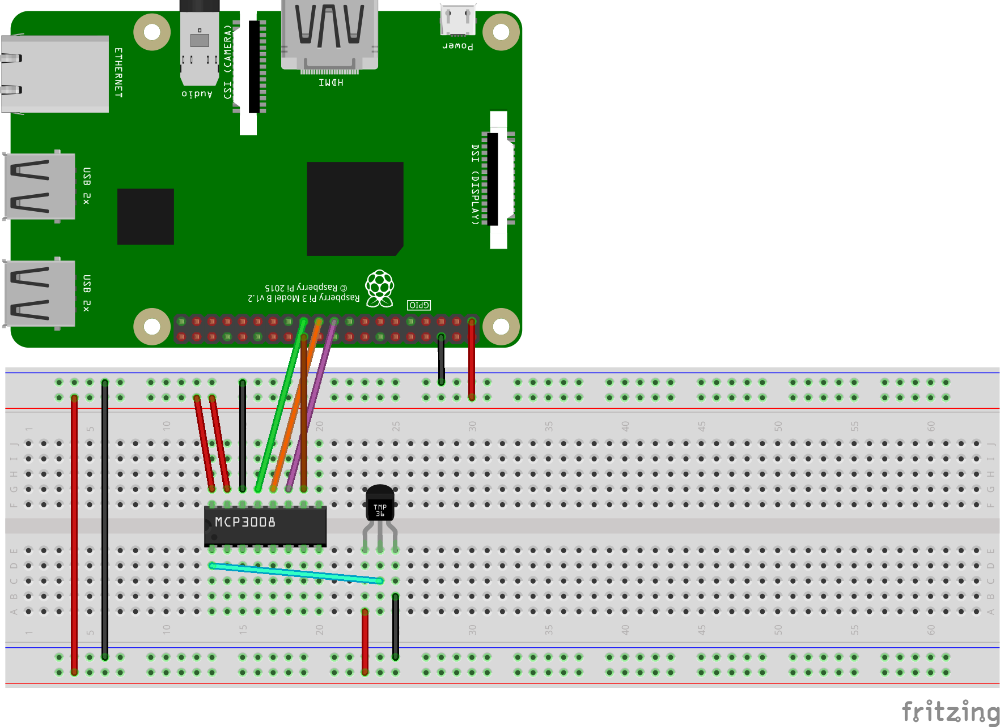

# Temperature Sensor
This project uses an MCP3008 with a TMP36 to measure the temperature. The temperature is available over HTTP get requests.

See http://ww1.microchip.com/downloads/en/DeviceDoc/21295d.pdf for mcp 3008 data sheet

## Raspberry Pi Hardware Configuration


## Raspberry Pi Software
* Install the necessary software:
```sh
pip install -r requirements.txt
```

## Raspberry Pi Server on Boot Setup
* Clone the repository
* Create a temp_server systemctl service
   * `sudo nano /lib/systemd/system/temp_server.service`  

```
[Unit]
Description=HTTP Server that reads tmp36 on GET
After=multi-user.target

[Service]
ExecStart=/usr/bin/python3 <path_to_server>temperature_sensor/temp_server.py

[Install]
WantedBy=multi-user.target
```

* Enable the service

```sh
sudo systemctl daemon-reload
sudo systemctl enable temp_server.service
sudo systemctl start temp_server
```

* To check on the status of the service

```sh
sudo systemctl status temp_server
journalctl -u temp_server.service
```

* To restart the service
```sh
sudo systemctl stop temp_server
sudo systemctl disable temp_server.service
sudo systemctl daemon-reload
sudo systemctl enable temp_server.service
sudo systemctl start temp_server
```

## Homebridge Setup
Use the HttpMultisensor plugin.

* Install the HttpMultisensor Homebridge plugin

```sh
sudo npm install -g homebridge-httpmultisensor
```

* Add the following to the `~/.homebridge/config.json` file

```json
{
   "accessory": "HttpMultisensor",
   "name": "Temperature",
   "type": "CurrentTemperature",
   "manufacturer" : "",
   "model": "Raspberry Pi tmp36",
   "serial": "<name>",
   "url": "http://<raspberry_pi_hostname>.local/<sensor_pin>",
   "http_method": "GET",
   "debug": true  
}
```
   * <raspberry_pi_hostname> is the hostname 
   * <sensor_pin> is the sensor pin number, integer between 0 and 7

* Restart the homebridge process

```sh
launchctl stop com.homebridge.server
launchctl start com.homebridge.server
```

* To checkup on the homebridge process

```sh
grep homebridge /var/log/system.log
```